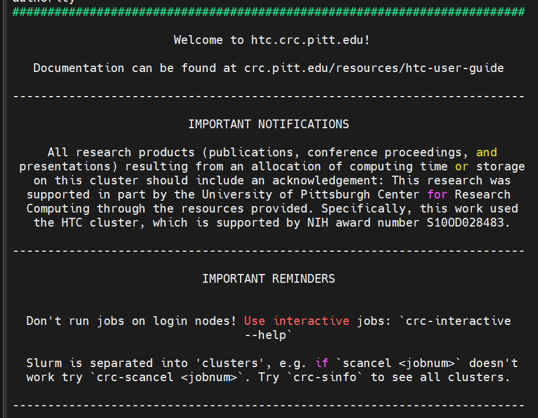
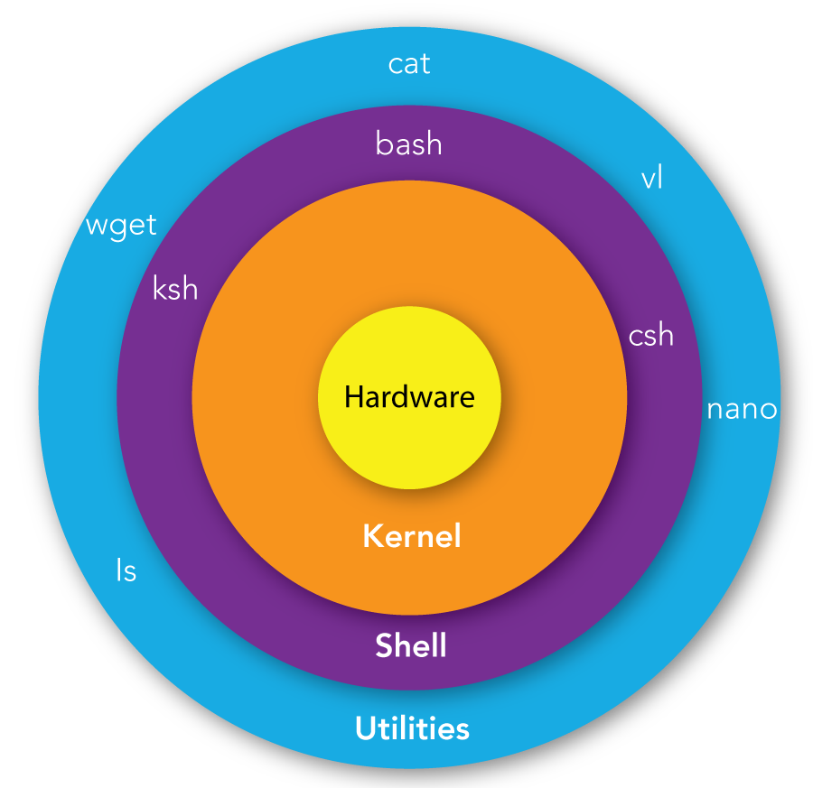

# **Bioinformatics with Pitt's Center for Research Computing (CRC) cluster**
*YNA lab training series, pt 1*


## What is the cluster?

*Image from CRC user manual*

The 'cluster' refers to the **CRC ecosystem** that contains the total footprint of the CRC infrastructure, including high performance computing clusters, data storage systems, networking equipment, and software. For us, we can simply imagine it as a giant, stronger, faster computer. 

Why are we using it? A typical laptop or personal computer does not have enough storage space or resources (Memory, Processing power) to analyse many sequencing files.
+ CUT&RUN ~ 3 Gb per experiment
+ DiMeLo-seq ~ 20 Gb per experiment  
\
The storage footprint of sequencing files can double or triple during analysis.

We conenct to the CRC cluster through our **Client**, which is the software we are using on our personal computer to interact with the CRC cluster. Our interactions with the cluster pass through an **Access Portal**, or a remote server that take the information we submit from our client and passes it on to the CRC cluster. \
 \
**Access portals** are typically remote servers, which refers to a computer system that is accessed over a network, like the internet, allowing users to store, manage, and access data and applications from anywhere with an internet connection, rather than being physically located in the same place as the user.

For us, our **client(s)** are Pitt's VPN software, which gives us access to Pitt's secure private network, and our terminal emulator software (MobaXterm or Termius), which allows us to establish a connection to the CRC. \
 \
Why is it called a terminal emulator? Take yourself way back in your imagination to when computers were huge and took up an entire room. The box that controlled the computer was called the terminal. Here, the terminal emulator is serving the same function for the CRC cluster, but instead of being connected to the giant computer (cluster), it's giving commands to the giant computer over the internet. 

Our **access portal** refers to how we are interacting with the cluster. We will primarily interact through the 'login node' pictured above. CRC also provides user access to viz (in-browser Linux Desktop environment on the CRCD system), OnDemand (requesting resources for interactive visual software, etc) and JupyterHub (web-based interactive development environment for notebooks, code, and data). 
<br />  
  \
**Let's log in!** By log in, I mean start your remote terminal session that connects you to the CRC cluster.

When you do, you should get some text in your terminal like:



**These notifications are so important!** However, they are a bit outdated.
+ The current user guide is at [crc manual](https://crc-pages.pitt.edu/user-manual/)
+ crc-interactive may be depricated; recommend using **SLURM** commands (see below)

Most importantly, **DO NOT RUN ON THE LOGIN NODE!** \
What is the login node? It's where you land after log in.
You can see your location next to your username at the commandline prompt. 
<br />  
```[user123@login1 ~]$  ```

Now that our terminal is connected to the CRC cluster, if we want to issue commands we have to speak in the computer's language so it can understand us. First, let's get an idea of how the CRC's logistic layers are arranged. 


*Source:https://mindmajix.com/shell-scripting-tutorial*

The cluster's kernel is run by [Linux](https://en.wikipedia.org/wiki/Linux), as opposed to an operating system like MacOS or Windows. The kernel is he primary interface between the computer's hardware and the software processes running on it.

The cluster is also 'wrapped' by a command-line interface (CLI) program that allows users to interact with the kernel by typing commands. This 'shell' wrapping the kernel is called [BASH](https://en.wikipedia.org/wiki/Bash_(Unix_shell)) (or Bourne Again Shell). 

The language(s) we speak to the computer in are either **Linux** or **Bash**. You will find a lot of murky language discussing Bash and Linux. In fact, it's easy (and common) to confuse Linux and Bash commands. And really there are only small differenes in when we use them. Technically, BASH commands are a subset of Linux commands focused on shell scripting, whereas Linux commands encompass a larger set of tools. Bash is primarily a user interface for communicating with Linux, though linux commands exist outside of Bash and can also be executed on the command line. 

There are many websites with cheat sheets for basic Bash and Linux commands. I like [this](https://www.geeksforgeeks.org/linux-commands-cheat-sheet/) and [this](https://cheatography.com/davechild/cheat-sheets/linux-command-line/) but there are so many amazing resources out there that you can find. If you have time, take a look [here](https://github.com/jlevy/the-art-of-command-line). The best resource is your search engine. Want to do something but do not know how? Ask Google or ask ChatGPT. 

Don't sleep on cuilt-in help options that come with utilities in the command line. 
For example, if using `tar`, try:
```
$ man tar

$ info tar

$ tar —help
```
  \
Ok, so we are using our **terminal emulator** software to speak **BASH** to the **Linux** kernel governing CRC's cluster hardware. 

Let's run some basic commands in the login node that do not require any resources.

+ Use `sinfo` to return the status of all clusters.

+ Use `crc-usage yarbely` to check on our storage allocation and what users are associated with it. 

+ Use `du -sh <directory_path>` to see how much space a directory is taking up on our storage allocation.

+ Or use `df -h <directory_path>` to see how much space we used and how much is available in our allocation.


Other than small commands, we cannot work on the login node so we need to request a place to work.

## The 'cluster' is composed of different clusters

The parts of the CRC ecosystem are organized into clusters designed for unique usage or tasks. 
<br />  
<br />  

| Cluster Acronym  | Full form | Usage description | Our usage |
| ------------- | ------------- | ------------- | ------------- |
| mpi  | Message Passing Interface  | For tightly coupled parallel codes that use the Message Passing Interface APIs for distributing computation across multiple nodes, each with its own memory space | none |
| htc  | High Throughput Computing  | For genomics and other health sciences-related workflows that can run on a single node | Most small to moderate tasks; ChIP-seq, C&R analysis |
| smp | Shared Memory Processing | For jobs that can run on a single node where the CPU cores share a common memory space | Any high-memory tasks; DiMeLo processing |
| gpu | Graphics Processing Unit | For AI/ML applications and physics-based simulation codes that had been written to take advantage of accelerated computing on GPU cores | Guppy basecalling requires a GPU |

<br />  
But what are nodes, cores, CPUs, etc?
<br />  
<br />  

**An illustration can be very helpful**
<br />  


*Read more about it here [Computing basics](https://ekatsevi.github.io/statistical-computing/hpc-basics.html)*

+ <ins>Node</ins>: a single computational unit within a cluster. Each node contains one or more CPUs and memory. A cluster can consist of a few to thousands of nodes, working together to execute large-scale computational tasks.
+ <ins>CPU (Central Processing Unit)</ins>: the primary computational engine of an HPC node. It executes the instructions of a computer program and interacts with other system components. CPUs typically have multiple cores, allowing them to process several tasks simultaneously.
+ <ins>Core</ins>: an individual processing unit within a CPU. Each core can independently execute instructions, so computational parallelization on HPC clusters typically occurs at the core level.
+ <ins>Memory/RAM (Random-Access Memory)</ins>: primary storage medium that the CPU uses to store and retrieve data. Each node has its own RAM, which is shared among the cores on that node.

Each cluster is composed of different hardware that offers different resources. Clusters also have individual regulations on how you request resources. For instance, you cannot request more than one node at a time on the htc cluster.

You can find more information about the organization of each cluster **here:**
+ [MPI](https://crc-pages.pitt.edu/user-manual/hardware_profiles/mpi/)
+ [HTC](https://crc-pages.pitt.edu/user-manual/hardware_profiles/htc/)
+ [SMP](https://crc-pages.pitt.edu/user-manual/hardware_profiles/smp/)
+ [GPU](https://crc-pages.pitt.edu/user-manual/hardware_profiles/gpu/)

  
<ins>**Remember**</ins>
+ Clusters are organized in a resource heirarchy
  + Cluster > partition > node > CPU > core
+ Always refer to the cluster organization to design your resource request--your request will be denied if the requested resources cannot be given
+ Request the right resources for the task you want to perform


## SLURM resource manager

**SLURM (Simple Linux Utility for Resource Management) resource manager** is a system for requesting resources from the cluster. Once you request resources, they are assigned to you as a 'job' that comes with a Job ID. You can request two different types of jobs with slurm:
+ **Interactive jobs** will run directly in your terminal emulator and you can interact with them using the command line prompt
+ **Batch jobs** are submitted directly to the cluster and run in the background--you do not see them being executed but you can specify diffeernt types of output to understand how they ran or are running

The four main commands we use for slurm are:
+ `srun` to submit an interactive job
+ `sbatch` to submit a batch job from a .txt file
+ `squeue` to check the status of all jobs you have submitted that are running
+ `scancel` to cancel a running job
<br />   

When requesting a job with slurm, there are many [options](https://slurm.schedmd.com/documentation.html). However, there are a few things we **MUST** include for the request to be completed:
+ `-t HH:MM:SS ` how long we would like our resources to be available to us in hours, minutes, seconds format
+ `-M or --cluster <htc, smp, mpi, gpu> ` the cluster we are requesting resources from
+ `--partition <partition name>` to specify the partition needed on the cluster
+ `--pty bash` to provide a bash pseudoterminal in **interactive mode**

Recommended options:
+ `--cpus-per-task` to specify how many CPUs to use for your task, this helps split tasks across multiple CPUs and complete them more efficiently
+ For **batch scripts**:
  + `--job-name=<name>` to specify a easy to read name for your job that you can see in job manager with `squeue`
  + `--error=<path/for/error/messages.txt>` and `--output=<path/to/save/terminal/output.txt.` to give you some readout on what happened/is happening in batch jobs running in the background

[Here](https://slurm.schedmd.com/pdfs/summary.pdf) is a cheat sheet to the basic slurm commands.

**Let's request an interactive job and leave the login node**

```srun -t 01:00:00 --cluster htc --partition htc --cpus-per-task=8 --pty bash```

You will recieve notification of your resource request and notification when it is granted. Resource requests can take longer to fill if you request a greater share of the resources. This is true for interactive and batch jobs. If resources are currently unavailable, you will be placed in a queue. 
Once resources are granted, you will see in your terminal that you are no longer in the login node and are now working in a node on the htc cluster. \
 \
 `[user123@htc-657-n3 ~]$` 

 If we enter `squeue -u <username> --cluster htc`, we will see our currently running job that we requested resources for on the htc cluster.

 **Now that we have a workspace, let's grab some files to practice with**

 There are 4 directories (folders, file paths) that you will work with on the cluster:
 + `/ihome/yarbely/<your_username>` is your personal home folder and scratch space
   + you can store small files here like models, custom scripts or whatever you please
   + when you build a virtual environment, it will be installed here
   + you can also custom install packages/utilities here   
 + `/ix1/yarbely/<your_username>` is your main data working area (your benchtop)
   + perform all data analyses in this large space
   + our storage allocation is shared by the entire lab    
 + `/ix1/yarbely/Data` is our operational space for storing new sequencing data
   + **NEVER** modify files in this folder
   + Copy them to your data benchtop before analyzing 
 + `/bgfs/yarbely/Data` is our 'defunct' space for storaing sequencing data
   + **NEVER** modify files in this folder
   + Copy them to your data benchtop before analyzing
   + We will never recieve more storage space here; if we remove things no longer used to a different storage space, we can add new things here

 /
 

 


